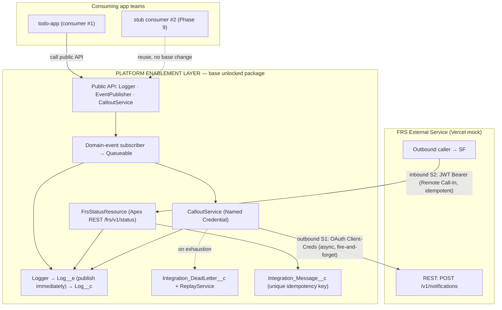
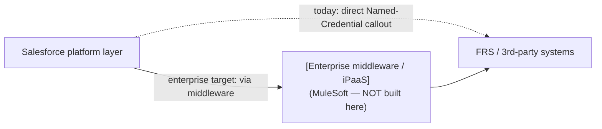

# Integration Architecture

> **Exercises:** integration deck `inventory-systems-and-integration-patterns`,
> `references.html` (layer approach, decision framework),
> `identify-performance-needs-and-integration-solutions`.
> **JD lines:** "Must have integration patterns"; "design… of platform services… enterprise
> patterns"; "engineering solutions across heterogeneous datacenter, cloud, and SaaS."
> **Implements:** ADR-002 (pattern), ADR-004 (logging). **RTM design coverage:** FR-5, FR-8,
> FR-10; NFR-6.

## 1. Context diagram

## 2. The two integration directions (layer-approach summary)

Per the deck's layer approach — every integration described by **layer · direction · timing ·
volume · transactionality · failure handling · initiator**:

| Dimension | S1 Outbound (notify) | S2 Inbound (status) |
|---|---|---|
| Layer | Business process | Data / process |
| Direction | SF → FRS | FRS → SF |
| Timing | **Async** (fire-and-forget) | Async near-real-time |
| Initiator | Salesforce | External FRS |
| Transactionality | Decoupled — user txn commits independently | Idempotent apply in its own txn |
| Volume | Low; bulk-safe to 200 | Low |
| Failure handling | Retry + backoff → dead-letter → replay (ADR-003) | Reject+log on auth/validation; dedupe on replay |
| Pattern | RPI Fire-and-Forget (ADR-002) | Remote Call-In (ADR-002) |

## 3. Sync vs. async decision (why nothing is synchronous Request/Reply)

The user-facing transaction must never block on the FRS system (NFR-4) and Apex forbids a
callout after uncommitted DML. Therefore **S1 is decoupled**: the consumer publishes a domain
Platform Event and returns immediately; the platform's subscriber enqueues a Queueable that
performs the callout *after* the original transaction has committed. The only synchronous
surface is **S2 inbound**, which is correct — the external caller *wants* an immediate
`applied`/`duplicate` acknowledgement (contract §4.2), and no Salesforce user is waiting on it.

## 4. Where enterprise middleware would sit (documented, not built)

In the real FRS estate, S1/S2 would traverse a middleware tier (routing, transformation,
canonical model, throttling). This project goes **point-to-point** because the free tier has
no middleware and the learning target is the *Salesforce* primitives. The insertion point is
deliberate: `CalloutService` is the single seam where a middleware endpoint later replaces the
direct FRS endpoint with **zero consumer changes** — which is exactly the "explicit
abstraction for application developers" the JD asks for, and why the Named Credential
(endpoint) is separated from the calling code.

## 5. Observability spine

Every box that touches an integration step calls `Logger` with a shared **correlation id**
(ADR-004). Because `Log__e` publishes immediately, the chain survives a rollback, and querying
`Log__c` by correlation id reconstructs the full round-trip (FR-10, NFR-6) — the data behind
the Phase 9 monitoring surface. Sequences for each path are in `sequence-diagrams.md`.
