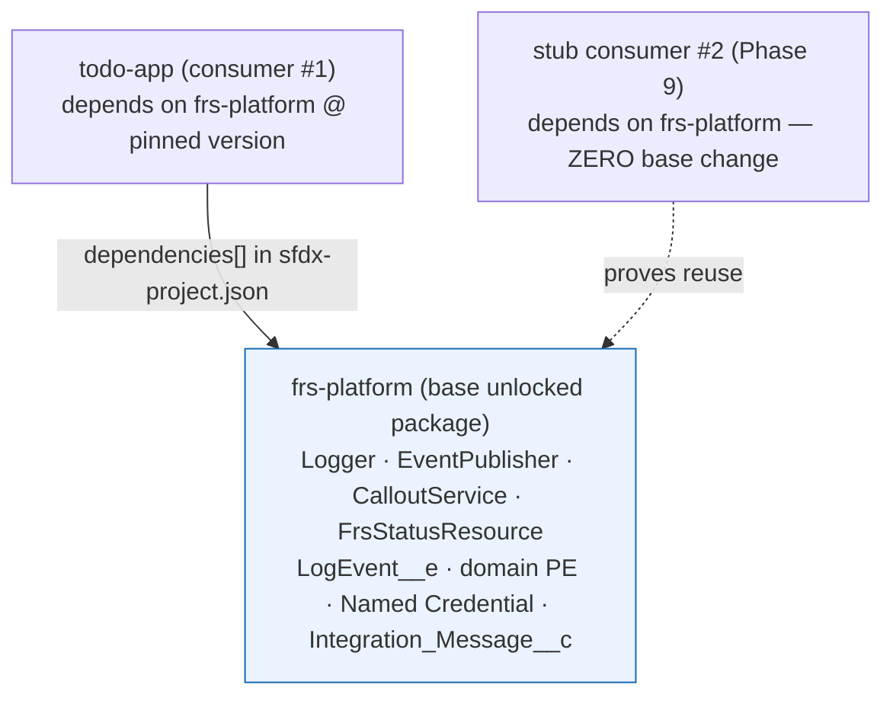
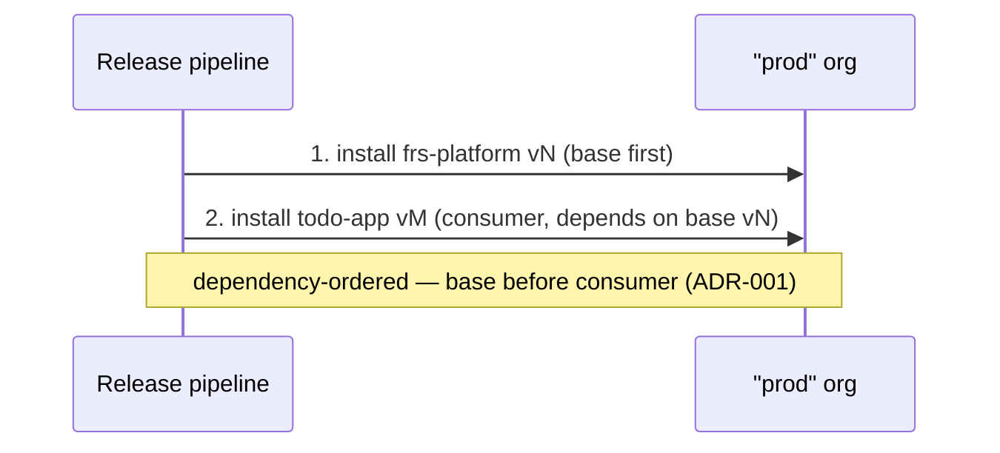

# Package Dependency Model

> **Exercises:** releasing-packaging-strategy (package dependencies, versioning),
> operating-managing-common-release-artifacts (immutable artifacts).
> **JD lines:** "reusable components in support of business products"; "supporting multiple
> application teams"; "versioning"; "scalable patterns."
> **Implements:** ADR-001 (packaging model). **Constrains:** NFR-8, NFR-11. **RTM design
> coverage:** NFR-8, NFR-11.

## 1. Dependency graph



The base package owns the **public API** (governed by `api-governance.md`). Consumers declare a
dependency on a **specific base version** and call only the public surface
(`public-api-spec.md`). The stub consumer #2 exists to prove the base is reusable with **no base
changes** — the JD's "multiple application teams" made executable.

## 2. Declaring the dependency (consumer side)

The consumer's `sfdx-project.json` references the base package version (by alias → subscriber
package version id):

```jsonc
{
  "packageDirectories": [{
    "path": "force-app",
    "package": "todo-app",
    "versionNumber": "1.1.0.NEXT",
    "dependencies": [
      { "package": "frs-platform", "versionNumber": "1.0.0.LATEST" }
    ]
  }],
  "packageAliases": {
    "frs-platform": "0Ho...",
    "frs-platform@1.0.0-1": "04t..."
  }
}
```

Version pinning policy: consumers pin to a **major.minor**; `LATEST` within a minor is safe
because the base guarantees no breaking change without a major bump (NFR-8). A base major bump
is a deliberate, Consumer-App-Lead-approved consumer migration (api-governance §3).

## 3. Install ordering (release & rollback)



- **Release:** base first, then consumer. The release runbook (Phase 8) encodes this order.
- **Rollback:** reinstall base vN-1 — but **only safe because** the public API + schema are
  additive-only within a major (NFR-11), so a consumer built against vN still resolves against
  vN-1. The Phase 8 rollback rehearsal does this **with the consumer installed** — the realistic
  case the todo-app couldn't exercise.

## 4. What the split buys (and costs)

| Buys | Costs |
|---|---|
| Real reuse: consumers take the platform without the app | Two repos, two release cadences |
| Immutable versioned base = rollback target (NFR-11) | Version pinning + dependency declaration discipline |
| API stability becomes testable (consumer-compat test, NFR-8) | API changes now ripple to consumers (governed by deprecation policy) |
| Dependency-ordered install = a genuine release-ops exercise | More ceremony than a monolith |

Phase 5 keeps the base package tiny so this dependency machinery is exercised while it's cheap
(the same "feel packaging friction early" tactic the todo-app used).
