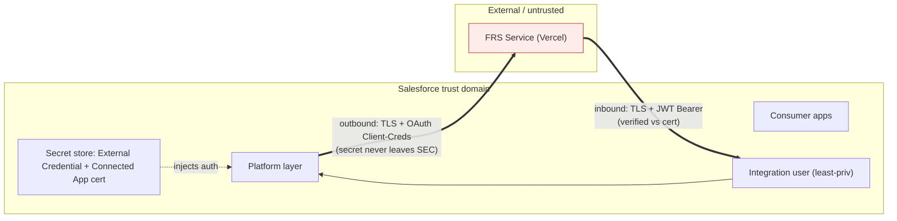

# Security & Trust Boundary

> **Exercises:** integration deck `evaluate-authentication-and-authorization-needs`,
> `identify-integration-security-authentication-authorization-requirements`,
> `classify-integration-data-confidential-secure-public`; system-design security model.
> **JD lines:** "Must have security model"; "Partner with Information Security… develop,
> implement and/or execute security configurations and controls"; "Manages the core security
> model configurations."
> **Implements:** ADR-005 (auth). **Constrains:** NFR-1, NFR-2. **RTM design coverage:** NFR-1,
> NFR-2, FR-4, FR-8.

> **This is the InfoSec handoff artifact.** It is what the Platform Engineer hands the InfoSec
> partner hat for the security sign-off required before any integration ships (charter
> decision-authority table). §6 is the sign-off checklist.

## 1. Trust boundary diagram

The boundary is crossed in exactly two controlled places (the two `==>` edges); everything
else stays inside the Salesforce trust domain. Each crossing is authenticated, encrypted, and
carries only Internal-class data (NFR-2).

## 2. Authentication & authorization (per ADR-005)

| Concern | Outbound (SF → FRS) | Inbound (FRS → SF) |
|---|---|---|
| Mechanism | Named Credential + **External Credential (OAuth 2.0 Client Credentials)** | **Connected App** + **OAuth 2.0 JWT Bearer** |
| Secret location | External Credential protected store (never in metadata/git) | Connected App holds the **public cert**; FRS holds the **private key** (off-platform) |
| Identity SF acts as / authorizes | service identity to FRS | dedicated **least-privilege integration user** |
| Code exposure | `callout:FRS_Service/...` — no URL/secret in Apex | endpoint authorizes via token; no inbound credential in code |
| Failure | `401/403` → non-retryable + **alert** | unauthenticated → reject `401/403` + log |

## 3. Least-privilege integration user (inbound)

- Dedicated user, **API-only** (no UI login), assigned a single permission set
  `FRS_Integration` granting **only**: access to the `FrsStatusResource` Apex class, and
  CRUD/FLS on **exactly** the target object/fields the callback updates + `Integration_Message__c`
  (idempotency). No broad object access, no modify-all, no admin.
- Verified by a `runAs(integrationUser)` test proving it **cannot** read/write anything outside
  its grant (NFR-1, risk R-7).
- Connected App policy: admin-approved-users-only, minimum OAuth scopes (`api` only), short
  token lifetime, IP relaxation only if required.

## 4. Secret & key handling

| Secret | Stored in | Rotated by |
|---|---|---|
| Outbound OAuth client secret (or API key) | External Credential protected store; CI uses masked GitLab variables (base64, per todo-app lesson) | Phase 8 secrets-rotation drill |
| Inbound JWT signing key (private) | Off-platform on FRS side only | Phase 8 drill (re-issue cert + key, zero downtime) |
| Inbound verification cert (public) | Connected App | Phase 8 drill |

**Rules:** no secret/endpoint in source or metadata committed to git; no secret in logs
(`Authorization` is Restricted, never persisted — NFR-2); CI variables masked + protected per
ref (the todo-app protected-ref lesson applies).

## 5. Data-in-transit & classification

- HTTPS/TLS on both crossings; JSON bodies carry only **Internal**-class fields per the
  `integration-contract.md` §5 dictionary; payloads validated against the dictionary allowlist
  (unknown field → `400`), preventing accidental over-sharing (NFR-2, risk R-8).
- No PII in scope; the regulatory framework (residency, retention, consent, audit) is
  documented for the FRS context in `system-landscape.md` §5 even though synthetic data is used.

## 6. InfoSec sign-off checklist (the handoff)

Before an integration ships, the **InfoSec hat** confirms:

- [ ] Outbound uses Named/External Credential; zero endpoint/secret in source (grep gate green)
- [ ] Inbound authenticated via Connected App + JWT Bearer; unauthenticated calls rejected+logged
- [ ] Integration user is least-privilege; `runAs` test proves it cannot exceed scope
- [ ] No secret/cert committed to git; CI variables masked + protected
- [ ] Cross-boundary payloads carry only Internal-class fields (dictionary allowlist enforced)
- [ ] `Authorization` and secrets never persisted to logs
- [ ] Secret/cert rotation procedure exists (Phase 8 drill scheduled)

Sign-off is recorded as a dated note here (hat + rationale) per the charter SoD rules.
