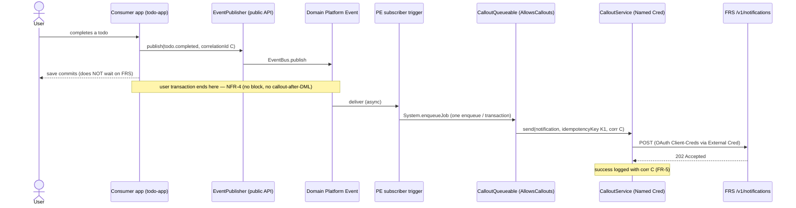
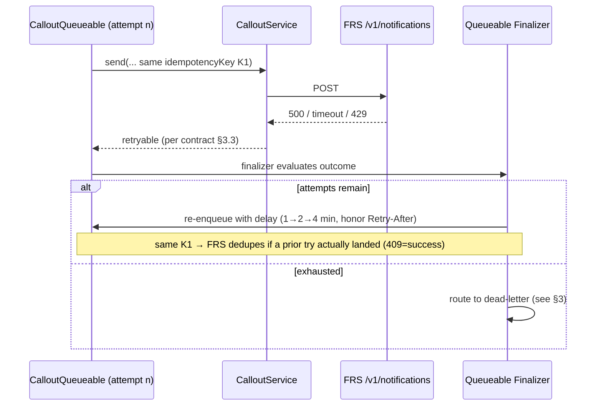
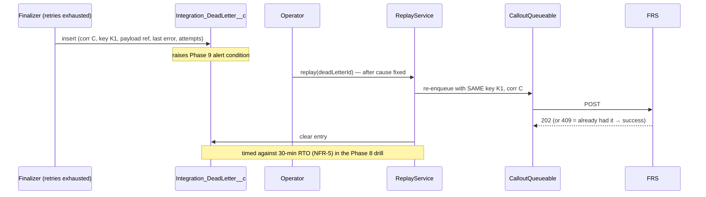
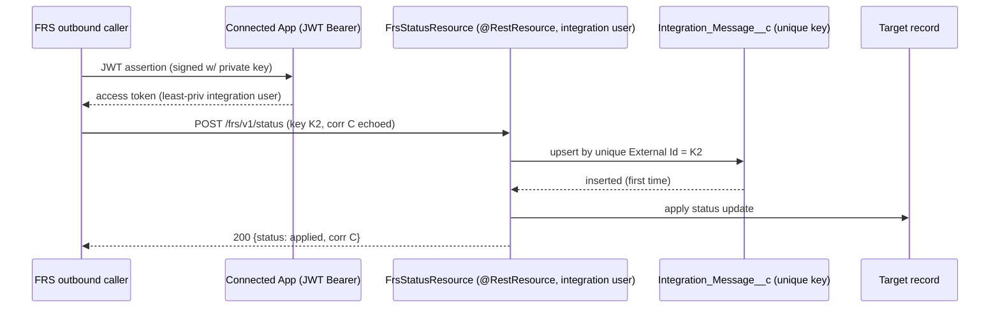
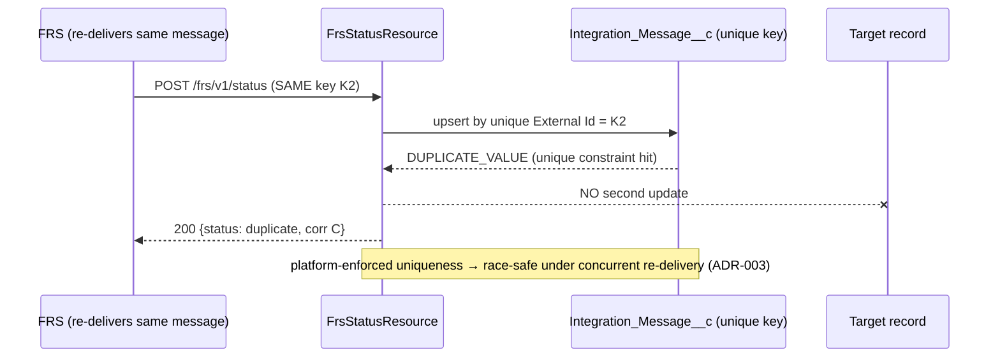
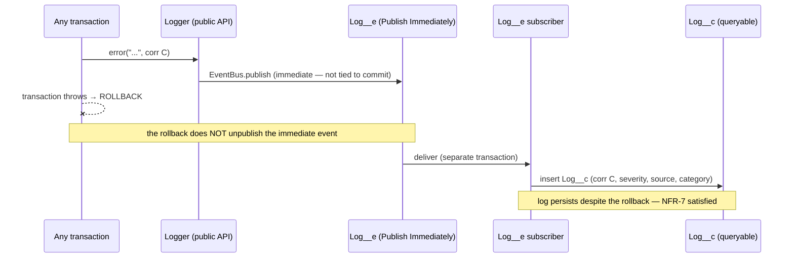
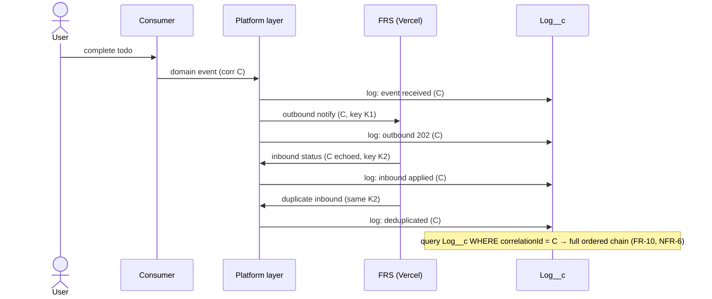

# Sequence Diagrams

> **Exercises:** building-quality-code (async patterns), integration deck (pattern timing/
> failure handling). **JD lines:** "Apex classes, triggers, asynchronous processing"; "Must
> have integration patterns"; resilient integration.
> **Implements:** ADR-002 (pattern), ADR-003 (retry/idempotency), ADR-004 (logging),
> ADR-005 (auth). **RTM design coverage:** FR-5, FR-6, FR-7, FR-8, FR-9, FR-10, FR-11;
> NFR-3, NFR-4, NFR-5, NFR-6, NFR-7.

Logging is omitted from §1–§5 for readability and shown explicitly in §6; assume every
participant calls `Logger` with the shared correlation id at each step.

## 1. Outbound S1 — happy path (RPI Fire-and-Forget, FR-5)

## 2. Outbound S1 — transient failure → retry with backoff (FR-6, NFR-5)

Non-retryable codes (`400`/`401`/`403`) skip retry entirely and go straight to dead-letter +
alert (auth failures are an InfoSec signal, ADR-005/NFR-1).

## 3. Outbound S1 — exhaustion → dead-letter → operator replay (FR-7, NFR-5)

## 4. Inbound S2 — happy path (Remote Call-In, idempotent apply, FR-8)

## 5. Inbound S2 — duplicate delivery → idempotent no-op (FR-9, NFR-3)

## 6. Logging — survives rollback (FR-2, NFR-7, ADR-004)

## 7. Full round-trip — one correlation id end to end (FR-10)

## Design rules encoded here

- **One `enqueueJob` per transaction** (§1), never per record → bulk-safe to 200 (FR-11/NFR-4);
  the 200-record `Limits` test proves it on this exact path.
- **Same idempotency key across retries/replay** (§2, §3) → the receiver dedupes; correlation
  id is separate and threads tracing (§7).
- **Unique-constraint upsert** for inbound dedupe (§5) → correct under concurrent duplicate
  delivery, not just sequential.
- **Immediate-publish logging** (§6) → the one mechanism that makes pre-failure logs durable.
